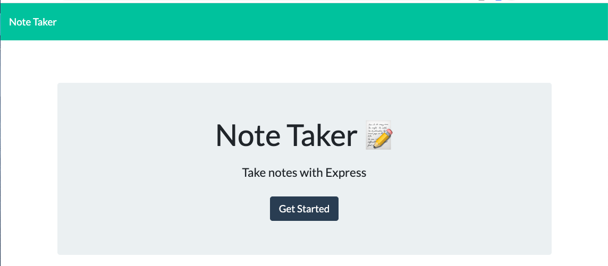

# Note Taker App - Week 11 Homework

## Preview

## Badges

## Description
The app is a simple note taker that allows a user to navigate to a notes page where the user enters a title and body of a note, and saves the note.

## Table of Contents
   * [Installation](#Installation)
   * [Usage](#Usage)
   * [License](#License)
   * [Tests](#Tests)
   * [Contribution](#Contribution)
   * [Collaborators](#Collaborators)
   * [Questions](#Questions)

## Installation
The User will need to install the express dependency using the following commant:
    npm install

The User simply needs to initiate the application entering the following command in the command line:
    node server.js

## Usage
The application is simple to use - we would encourage anyone experiencing difficulty to get in touch.

## License
MIT license

## Tests
npm test

## Contribution
The design and content of the application is derived from a review of material provided by Trilogy Education Service.

## Collaborators
There are many ways in which you can participate in the project, for example:

- Submit bugs and feature requests, and help us verify as they are checked in
- Review source code changes
- Review the documentation and make pull requests for anything from typos to new content

## Questions
Email: christopher.j.natale@gmail.com.
Github Profile: http://github.com/cnat3103